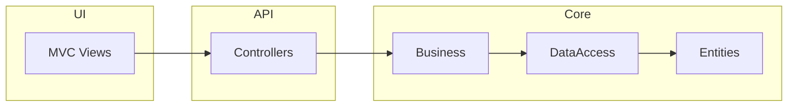

# CozaStore - E-Commerce Platform

> Modern ve ölçeklenebilir e-ticaret platformu. ASP.NET Core 9 Web API + MVC, Clean Architecture. 60 saniyede keşfet.

## What it is

CozaStore, ürün kataloğu, sepet, sipariş, admin paneli ve JWT auth sunan tam özellikli bir e-ticaret uygulamasıdır. Clean Architecture ve SOLID prensipleri ile geliştirilmiştir.

## Features

### Kullanıcı
- Ürün listeleme, detay, kategori filtreleme
- Sepet, wishlist, sipariş oluşturma ve takip
- Ürün yorumlama, iletişim formu, blog

### Admin
- Ürün, kategori, sipariş, blog CRUD
- Yorum onaylama, iletişim mesajları, dashboard

## Tech Stack

- **API:** ASP.NET Core 9, EF Core, JWT, FluentValidation
- **UI:** ASP.NET Core MVC 9, Razor, Bootstrap 5, AdminLTE
- **Database:** SQL Server / SQLite
- **Architecture:** Clean Architecture, Repository, Unit of Work

## Architecture



## Run Locally

### Manuel Kurulum

```bash
git clone https://github.com/dugerdev/CozaStore.git
cd CozaStore
```

**WebAPI** `appsettings.json` – ConnectionStrings düzenle.

**WebUI** `CozaStoreWebUI/CozaStore.WebUI/appsettings.json` – ApiSettings.BaseUrl (örn. `https://localhost:7001/api`)

```bash
cd CozaStoreWebAPI
dotnet ef database update
dotnet run
```

İkinci terminalde:

```bash
cd CozaStoreWebUI/CozaStore.WebUI
dotnet run
```

- **WebUI:** https://localhost:7002
- **Swagger:** https://localhost:7001/swagger

### Varsayılan Hesaplar

| Rol | Email | Şifre |
|-----|-------|-------|
| Admin | admin@cozastore.com | Admin123! |
| User | user@cozastore.com | User123! |

## Live Preview

🔗 [Demo](https://github.com/dugerdev/CozaStore) *(deploy URL eklenebilir)*

## Test / CI

- **Test:** `dotnet test`
- **CI:** GitHub Actions – build ve test

## Repo Hijyeni

- [x] `.env.example` – Ortam değişkenleri şablonu
- [x] `LICENSE` – Lisans dosyası
- [x] `.gitignore`

---

## .env.example

`.env.example` proje kökünde. Docker/CI için:

```
ConnectionStrings__DefaultConnection=Server=localhost;Database=CozaStoreDb;Trusted_Connection=True;TrustServerCertificate=True
JwtSettings__SecretKey=your-32-char-secret
ApiSettings__BaseUrl=https://localhost:7001/api
ASPNETCORE_ENVIRONMENT=Development
```

## License

MIT License – [LICENSE](LICENSE)
